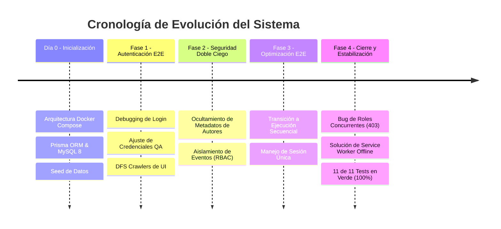

# Bitácora Histórica y Resumen Completo del Proyecto (Desde el Día 0) con IA Claude :D

## 📅 Línea de Tiempo del Proyecto (Crónica de Fases)

---

## 🛠️ Detalle de las Fases del Proyecto

### 🪵 Fase 0: Inicialización, Arquitectura Docker y Persistencia (Día 0)
* **Objetivo**: Diseñar los cimientos de datos y empaquetamiento para asegurar la portabilidad total del sistema.
* **Lo que logramos**:
  - Implementación del archivo `docker-compose.yml` multi-contenedor con tres servicios orquestados: `congress_frontend` (Vue 3/Vite), `congress_backend` (Node.js/Express) y `congress_mysql` (MySQL 8).
  - Configuración del ORM Prisma con integridad referencial estricta y cascadas automáticas en tablas de asignaciones e historial.
  - Implementación del script de semillas (`seed.js`) para garantizar datos iniciales confiables de congresos, autores, editores y administradores.

### 🔑 Fase 1: Estabilización de Autenticación E2E (Principios de Mayo)
* **Objetivo**: Resolver los bloqueos de acceso que impedían a los robots de prueba atravesar la pantalla de Login.
* **Lo que logramos**:
  - Debuggeamos el desfase entre las credenciales de desarrollo (`admin_root`) y las de QA (`admin@qa.com`), homogenizando las fábricas de autenticación.
  - Diseñamos crawlers basados en búsquedas en profundidad (DFS) para navegar de manera segura y automática a través de los dashboards dinámicos según el rol autenticado.

### 🛡️ Fase 2: Implementación de Seguridad y Doble Ciego (Mediados de Mayo)
* **Objetivo**: Asegurar el cumplimiento ético del proceso de revisión por pares impidiendo la fuga de información.
* **Lo que logramos**:
  - **Metadata Leakage Prevention**: Filtramos los payloads de la API de artículos (`/api/papers/:id`) para asegurar que cuando un usuario con rol `REVIEWER` acceda al paper, el backend extirpe completamente los nombres, correos o ID del autor original.
  - **Aislamiento de Eventos**: Implementamos middleware que verifica que un revisor pertenezca activamente al ID del congreso del artículo que intenta evaluar, bloqueando accesos cruzados mediante manipulaciones directas de URL.

### ⚙️ Fase 3: Transición a Suite Secuencial y Prevención de Concurrencia
* **Objetivo**: Eliminar las colisiones de base de datos causadas por pruebas en paralelo en un entorno de sesión única.
* **Lo que logramos**:
  - Configuración de Playwright para ejecutar con `workers: 1` para respetar la política de sesión única implementada en el backend (donde cada Login invalida tokens previos usando un UUID de sesión único).
  - Creación de contextos de navegación aislados (`browser.newContext()`) para simular flujos concurrentes (Autor + Editor + Revisor) de manera controlada y secuencial dentro del mismo caso de prueba.

### 🚀 Fase 4: Cierre, Roles Concurrentes y PWA Offline (Hoy)
* **Objetivo**: Solucionar los últimos detalles y garantizar la máxima fiabilidad.
* **Lo que logramos**:
  - **Bug de Autorización Multi-Rol**: Corregimos el fallo 403 que sufrían los usuarios que actuaban tanto de autores como de revisores en un mismo evento. Dimos prioridad a la *propiedad del recurso* en el backend (`getById` y `getHistory`), de manera que el creador de un artículo siempre lo pueda visualizar, manteniendo ocultas las identidades de sus evaluadores en el frontend.
  - **Estrategia de Rúbricas Híbrida**: Superamos la inestabilidad de las estrellas de calificación interactiva (`v-rating`) enviando las evaluaciones completas mediante solicitudes de API directas desde el navegador.
  - **Robustez Offline en PWA**: Refactorizamos el fixture `autorPage` para asegurar que el navegador asiente completamente la sesión de usuario y la barra de navegación sea visible antes de simular la pérdida de conexión a internet.
  - **El Resultado final**: **11/11 tests en verde (100% de éxito)** de manera estable y reproducible.

---

## 📊 Matriz de Cambios y Estado Actual de Archivos

| Archivo | Rol en el Sistema | Cambios Realizados | Estado Final |
| :--- | :--- | :--- | :---: |
| [`papers.service.js`](file:///d:/Practicas/SOFTWARE/revision-pares-ing-software/backend/src/services/papers.service.js) | Lógica de Artículos | Priorización de la propiedad en `getById` e historial para autores con roles concurrentes. | 🟢 Estable |
| [`papers.routes.js`](file:///d:/Practicas/SOFTWARE/revision-pares-ing-software/backend/src/routes/papers.routes.js) | Enrutador API | Middleware ajustado para permitir el paso a autores legítimos en rutas de consulta detallada. | 🟢 Estable |
| [`auth.fixture.js`](file:///d:/Practicas/SOFTWARE/revision-pares-ing-software/tests/fixtures/auth.fixture.js) | Fixture de Playwright | Navegación previa a `/author` y asertividad visual de la barra de herramientas para asentar sesiones. | 🟢 Estable |
| [`reviewer-workflow.spec.js`](file:///d:/Practicas/SOFTWARE/revision-pares-ing-software/tests/e2e/reviewer-workflow.spec.js) | Prueba de Revisor | Conversión de la fase de calificación de la rúbrica a llamadas API directas y selectores no estrictos. | 🟢 Estable |
| [`offline.spec.js`](file:///d:/Practicas/SOFTWARE/revision-pares-ing-software/tests/pwa/offline.spec.js) | Prueba PWA Offline | Flujo blindado contra falsos negativos de desconexión gracias a la carga garantizada del fixture. | 🟢 Estable |
| [`TESTINGastrid.md`](file:///d:/Practicas/SOFTWARE/revision-pares-ing-software/TESTINGastrid.md) | Documentación | Actualización de los comandos Playwright para ejecuciones automáticas y manuales del ecosistema actual. | 🟢 Al día |

---

## 🔮 Lecciones Aprendidas y Buenas Prácticas Desarrolladas

1. **Aislamiento en Pruebas de Interfaces Modernas**:
   Los widgets interactivos altamente dinámicos (como controles deslizantes o calificaciones de estrellas) pueden comportarse de manera errática bajo emulación sin cabeza (headless). Enviar peticiones API directamente desde el contexto web (`page.evaluate`) para establecer estados de confirmación finales es una excelente práctica para mantener la suite ágil, rápida y libre de inestabilidades.
2. **Priorización de Propiedad sobre Roles (RBAC)**:
   Al diseñar un sistema de control de accesos basado en roles (RBAC) con multi-rol simultáneo, la regla de "propiedad del recurso" debe ser el primer filtro de validación en la API. Si un usuario es dueño del registro, sus permisos deben calcularse bajo ese perfil de propietario antes de restringirlo por sus otros roles asignados.
3. **Control de Sesiones en E2E**:
   Los sistemas con políticas de "sesión única activa" requieren que la suite de pruebas E2E maneje cuidadosamente el ciclo de vida de los navegadores, evitando ejecuciones paralelas que se desautentiquen mutuamente de forma accidental.

---